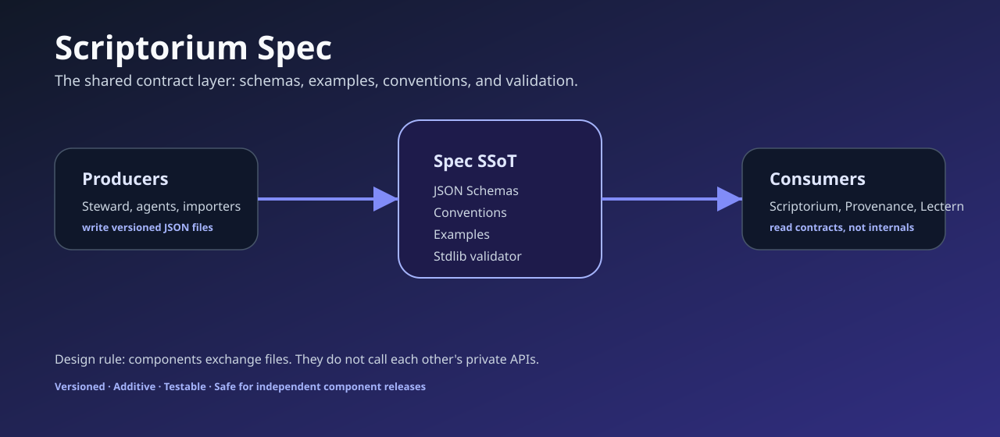

# Scriptorium Spec

[](https://github.com/scriptorium-suite/scriptorium-spec/actions/workflows/ci.yml)
[](https://github.com/scriptorium-suite/scriptorium-spec/releases)
[](LICENSE)

Scriptorium Spec is the contract source of truth for the Scriptorium suite. It defines the versioned files that let independent tools exchange project, literature, evidence, review, and handoff data without importing each other's private code.



## Why this repository exists

Scriptorium is organized as a suite rather than a single monolithic application. That only works if every component can agree on what a project file, note, review, handoff, claim, or run record means. This repository keeps those agreements explicit, testable, and versioned.

The design rule is: components exchange files, not internals. Steward can produce a literature handoff, Provenance can consume project memory, and Scriptorium can coordinate the workflow because all of them share the same public contracts.

## What's included

| Area | Contents |
| --- | --- |
| `schemas/` | JSON Schemas for project, note, session summary, library KB, handoff, parsed paper, lineage graph, reading note, review, experiment run, and claim evidence. |
| `examples/` | Valid examples for each public format. |
| `specs/` | Human-readable conventions for versioning, vault layout, sync, trust, literature automation, and execution/evidence records. |
| `tools/validate.py` | A standard-library validator for examples and downstream generated files. |
| `tests/` | Contract checks and release consistency tests. |

## Quick start

```powershell
git clone https://github.com/scriptorium-suite/scriptorium-spec.git
cd scriptorium-spec
py -m venv .venv
.\.venv\Scripts\python.exe -m pip install -e .
.\.venv\Scripts\python.exe tools\validate.py examples\*.json
```

Run the test suite:

```powershell
.\.venv\Scripts\python.exe -m pytest
```

## Contract families

| Contract | Purpose |
| --- | --- |
| `project` | Stable project identity and portfolio metadata. |
| `note` / `session-summary` | Sync-layer notes and session closeout summaries. |
| `library-kb` / `parsed-paper` / `lineage-graph` | Literature source, parsing, and citation relationship records. |
| `reading-note` / `review` | Human-readable reading and review outputs. |
| `proposal` / `handoff` | Structured handoff from literature work into downstream project tasks. |
| `experiment-run` / `claim-evidence` | Development contract for execution facts and reviewed evidence claims. |

## Versioning policy

Schemas are versioned and intended to evolve additively. A consumer should dispatch on `schema_version` and reject unknown or incompatible versions instead of guessing. Breaking changes require a new schema version and updated examples.

## Relationship to the suite

This repository is not a runtime package. It is the public contract layer for:

- [scriptorium](https://github.com/scriptorium-suite/scriptorium): suite entry point and installer.
- [steward](https://github.com/scriptorium-suite/steward): producer of literature and handoff artifacts.
- [Provenance](https://github.com/foxsplendid/Provenance): consumer and producer of project memory and sync records.
- [Academic-Slides-Agent](https://github.com/foxsplendid/Academic-Slides-Agent): optional downstream consumer for presentation artifacts.

## Safety posture

The contracts separate raw sources, AI-generated drafts, execution facts, and user-reviewed claims. A successful run record is not automatically a scientific or project claim. A claim becomes accepted only through the review semantics defined by the relevant spec and implemented by the runtime component.

## License

Apache-2.0. See [LICENSE](LICENSE).
